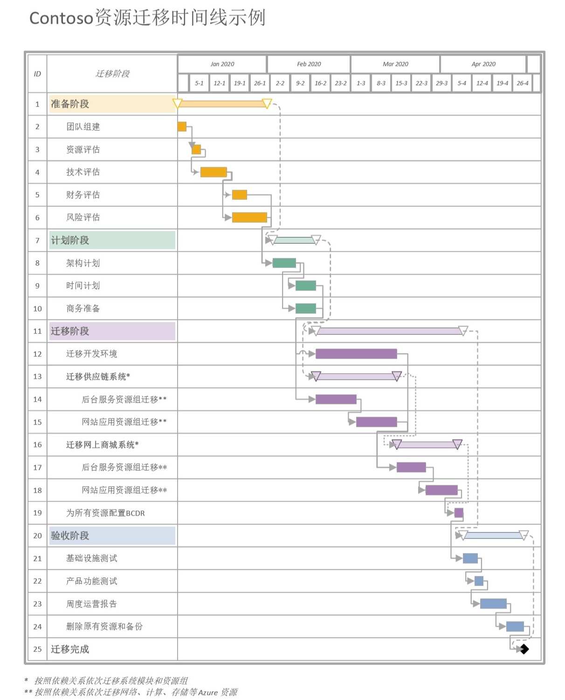

# 计划、搬迁、验收
在经过以上的评估之后，管理层决定 Contoso 中国分公司确定开启其 Azure China 迁移项目，你可以开始协调各个部门及 V-Team 开始以下三个阶段的工作。

## 计划阶段

在技术评估阶段，您需要协同 **决策V-Team** 和 **执行V-Team** ，根据可行性评估，从以下不同角度完成计划：

### 架构计划 
 * 订阅： 
   *  经过评估，Contoso 公司首先需要在新区域中创建 Azure 租户，迁移并改进原有的3个订阅：开发环境、ToB供应链服务、ToC网页商城服务。  
   *  订阅管理员需要重新检查并更新3个新订阅的 RBAC 权限设置。  
   *  由于迁移后会使用更多托管服务，您需要重新设计 Azure 门户中的 [**Policy**]()、[**Monitor**]()、[**Adviser**]() 中的配置。  

 * 资源：  
   *  根据资源之间复杂度和依赖关系，各个资源之间的搬迁顺序为：网络 → 存储 →  计算。  
      * 网络：确定新区域中的网络规划，例如：申请新的网段/ VNet/ ER 专线等。    
      * 存储：架构师建议在中国东部1区域完成数据库和存储升级，再进行数据迁移。  
      * 计算：Contoso 计划在搬迁过程中先将型号较老的 D 系列虚拟机升级成 DSv2，将 Windows Server 虚拟机升级成 Kubernets 虚拟机，然后再进行资源迁移。   
    *  Contoso 公司原来在中国东部2区域时只对存储数据进行了备份计划，架构师提出本次迁移过程中需要为中国北部2区域的资源制定业务连续性和灾难恢复 (BCDR) 策略，以确保工作负荷和数据在计划和非计划停机期间保持99.999%可用性。这需要在资源迁移完成之后删除掉在中国北部1区域的数据备份，重新在中国东部2区域进行完整的灾难备份。您还需要考虑进行灾难备份额外花费的资源与成本。  

### 时间计划
  * 整个迁移项目周期预计持续 2-3 个月，您需要充分考虑各个服务对迁移时间的需求。例如迁移网页商城和供应链相关的业务时需要避开“双11”，“6.18”等线上购物高峰期。  
  * 为了将对客户的影响降到最小，决策团队决定先搬迁开发环境订阅，经过内部测试之后再大规模搬迁 ToB 供应链订阅中的资源，然后迁移ToC 网页商城订阅中的资源。  
  * 您需要协同 **决策V-Team**、**执行V-Team** 和团队成员共同谈论可行的时间线和计划表，保证所有利益相关者知情并同意，能够全力配合本次迁移项目。

Contoso 公司制定的时间计划如下：

### 商务准备
 * 与商务和财务人员讨论重新签署 CPP 合同，并根据 CPP 合同中承诺的资源进行架构调整。
 * 迁移后 Contoso 公司需要新的 IP 地址和域名，需要确保这些已经备案。
 * 有一些资源在新区域需要采购新的 Liscence，请联系相关团队进行准备 

### 在此阶段结束时，您将拥有： 
*  迁移计划报告：部署体系结构的具体设计文档。
*  成本分析报告：基于可行性评估阶段的报告，精细化你的成本分析，包括迁移成本和目标环境的资源消耗等。  
*	新的CPP合同：根据预测 Contoso 在中国北部2区域的资源用量，重新签订CPP合同。这需要对 Azure 做出前期货币承诺，同时可让 Contoso 获得众多权益，包括灵活的计费选项和最优惠价格。
*  新的 Lisence、网络及域名：根据 Contoso 公司的实际情况，重新准备相应的资源。
*	时间线和计划表：根据迁移计划表，为迁移项目建立大致时间线和里程碑。

## 迁移阶段

Contoso 公司在中国东部1区域使用的资源比较简单，只有 计算/存储/网络 这三类。如果您的公司有更多的复杂资源，请注意根据公司的实际评估结果和迁移计划进行迁移。

### 迁移步骤
1.	在 Azure 中国北部区域2 的开发环境订阅中创建新的资源组 CONTOSORG2。
2.	[在目标区域中创建新的虚拟网络。](https://docs.azure.cn/zh-cn/articles/azure-china-migration-playbook/china-migration-guidance-networking)
3.	在新区域中创建和配置 VPN 网关的新实例。需要注意的是有一些 PaaS 服务不支持 Vnet Peering，需要手动配对。
4.	升级并[迁移存储资源。](https://docs.azure.cn/zh-cn/articles/azure-china-migration-playbook/china-migration-guidance-storage)
5.	[使用ASR迁移虚拟机到中国北部2 的资源组。](https://docs.azure.cn/zh-cn/site-recovery/azure-to-azure-tutorial-migrate)
6.	配置 CONTOSORG2 新建的资源。
7. 重复步骤1-6依次迁移供应链订阅和网页商成订阅。
8.	检验迁移过程中是否产生新增数据。如果有，将最新数据同步到目标环境。 
9.	为迁移后的所有资源[配置灾难恢复和备份。](https://docs.azure.cn/zh-cn/site-recovery/azure-to-azure-quickstart)

### 在此阶段结束时，您将拥有： 
*  在新的区域部署的资源及配置的完整列表。 
*	新区域资源的灾难恢复和备份。

## 验收阶段

当资源迁移已经完成，则进入验证阶段，您和团队应当完成以下任务，验收迁移成果并将应用服务上线：
*	基础设施测试。  
*	验证生产环境是否按预期工作。
*	按照应用程序逐一完成用户验收测试，确保每个应用程序按预期工作。 
*	决定正式在中国北部2区域中上线新应用程序实例。 
*  监测迁移后月度/周度的运营报告，确保迁移过程中没有造成问题和风险，所有应用程序正常运行，工作人员和客户反馈良好。
*	取消配置中国东部1区域中的资源。
*  删除在中国东部1区域中的资源和中国北部1区域中的数据备份。

当以上任务完成，恭喜您，您已经完成了Azure China迁移项目！请在新区域中尽情发展您的业务，享受Azure带给您的便利。

