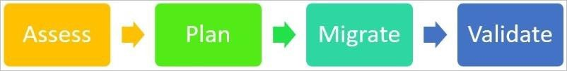

# 迁移过程

本章节提供的指南可帮助您了解Azure资源从一个 Azure 区域迁移到另一个区域的整体过程。迁移过程的重点是如何制订出应用程序的整体迁移计划，然后依据迁移计划依次迁移 Azure 资源。
迁移过程中的步骤如下：

## 评估

您应当召集 Azure 帐户所有者、订阅管理员、租户管理员以及金融和会计团队，以了解计划迁移的组织规模，这一点非常重要。担任这些职能的工作人员可提供大型组织对 Azure 使用的完整信息。
在评估阶段，编制一份资源清单：
* 每个订阅管理员和租户管理员应运行一系列脚本来列出资源组、每个资源组中的资源以及环境中的资源组部署设置。
* 您应当记录 Azure 中各应用程序之间以及与外部系统的依赖关系。
* 您还应当记录与要迁移的每个实例关联的每个 Azure 资源的数量以及数据量。
* 确保应用程序体系结构文档与 Azure 资源列表保持一致。

在此阶段结束时，您将拥有：
* 需要迁移的 Azure 资源的完整列表。
* 资源之间的依赖关系列表。
* 有关迁移工作复杂性的信息。
 
## 计划

在计划阶段，您应当完成以下任务：
* 使用在评估阶段完成的依赖关系分析的输出结果来定义相关组件。请考虑通过迁移包迁移相关组件。
* （可选）利用迁移过程来应用 [**Gartner 5-R**](https://www.gartner.com/newsroom/id/1684114) 标准和优化工作负载。
* 确定目标 Azure 区域中的目标环境。
* 识别目标 Azure 租户（如有必要，创建一个）。
* 创建订阅。
* 选择目标 Azure 区域。
* 执行使源 Azure 区域中的体系结构与目标区域中的体系结构相匹配的测试迁移方案。
* 确定合适的迁移时间线和计划表。为每个迁移包创建用户验收测试计划。

## 迁移

在迁移阶段，使用以下各节中讨论的工具、技术和建议在目标区域中迁移或创建新资源。然后，配置应用程序。

## 验证

在验证阶段，完成以下任务：
* 完成用户验收测试。
* 如果适用，将最新数据同步到目标环境。
* 确保应用程序按预期工作。
* 切换到目标区域中的新应用程序实例。
* 验证生产环境是否按预期工作。
* 取消配置源区域中的资源。

## 术语

以下各节使用了这些术语：

### **源**描述了从哪里迁移资源：
* **源租户名称**：源 Azure 区域中租户的名称（帐户名称中 @ 之后的所有内容）。
* **源租户 ID**：源 Azure 区域中租户的 ID。将鼠标移到右上角的帐户名称时，租户 ID 将显示在 Azure 门户中。
* **源订阅 ID**：源 Azure 区域中资源订阅的 ID。您可以在同一个租户中拥有多个订阅。请始终确保您使用的是正确的订阅。
* **源区域**：迁出资源所在的区域。

### **目标**或**目的地**是指接收迁移资源的目的位置：
* **目标租户名称**：目标 Azure 区域中租户的名称。
* **目标租户 ID**：目标区域中租户的 ID。
* **目标订阅 ID**：目标区域中资源的订阅 ID。
* **目标区域**：接收迁移资源的目的区域。

### 注意
验证您要迁移的 Azure 服务是否在目标区域中提供。

